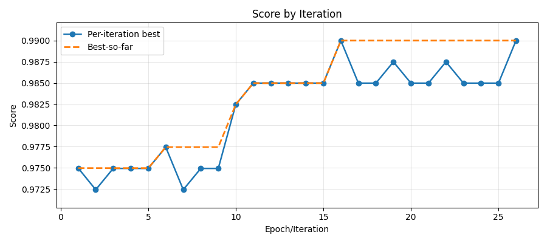
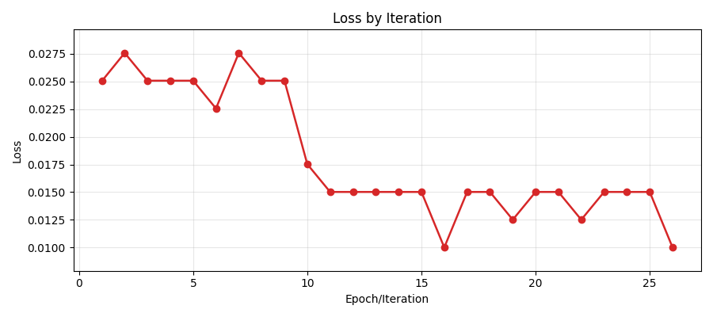
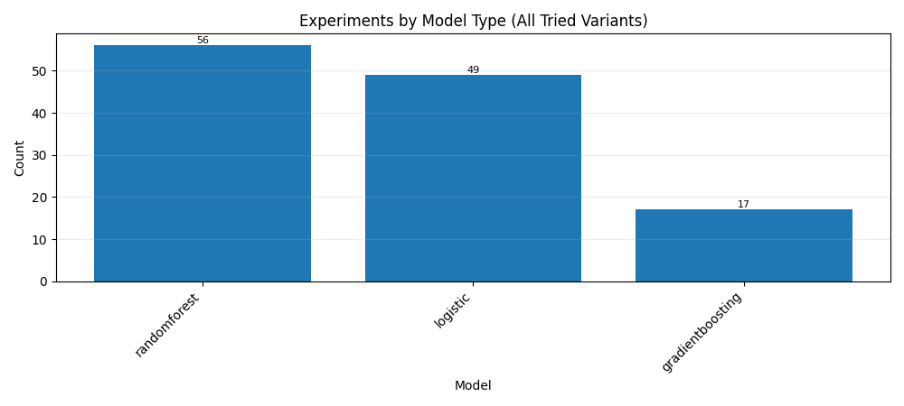
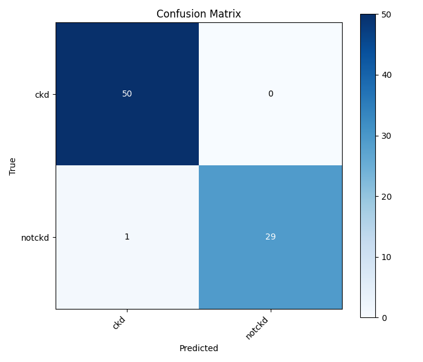

# ezAutoML

Automated machine learning research agent that uses LLM-guided reasoning to iteratively improve models.

## Features

- **Natural Language Input**: Describe your ML problem in plain English
- **Automatic Dataset Search**: Uses Playwright browser search/download flow (Kaggle-style)
- **Intelligent Preprocessing**: Auto-detects column types and applies appropriate transformations
- **Multi-Variant Training**: Trains up to 5 variants per iteration from a curated top model set
- **LLM-Guided Improvement**: Uses LLM analysis to suggest and generate new variants
- **Feature Selection Modes**: Runs full, LLM-guided, model-based, and hybrid feature-selection strategies
- **Data-Quality Guardrails**: Auto-drops likely ID columns, high-missing, constant, and low-variance features
- **Patience-Based Stopping**: Stops automatically when no improvement for N iterations
- **Model Registry**: Saves best model with full metadata
- **Training Visuals + Report**: Saves score/loss trend graphs and final metrics report
- **FastAPI Deployment**: Ready-to-use REST API for predictions
- **`main3` Strategy**: Alternate Kaggle-first resolver with leakage-aware candidate rejection

## Architecture

```
Natural Language → Problem Interpreter → Dataset Search → Profiling → Preprocessing
     ↓
Pipeline Generation → Training & Evaluation → Experiment Tracking
     ↓
LLM Analysis → Variant Generation → [Iterate] → Registry → API Deployment
```

## Installation

### Prerequisites

- Python 3.10+
- Groq API key (get from https://console.groq.com/)

### Setup

1. **Clone or download this repository**

2. **Install dependencies**:
   ```bash
   pip install -r requirements.txt
   ```

3. **Install Playwright browsers** (required for dataset auto-search):
   ```bash
   playwright install chromium
   ```

4. **(Recommended) Initialize Kaggle authenticated session once**:
   ```bash
   python -m auto_ml_research_agent.dataset.browser_agent --init-kaggle-session
   ```
   This opens a browser window. Log into Kaggle, then press Enter in terminal to save session state.

5. **Set up environment variables**:
   ```bash
   cp .env.example .env
   # Edit .env and add GROQ_API_KEY (and optional GROQ_API_KEY2..GROQ_API_KEY5 for failover)
   ```

## Usage

### Basic Usage

```bash
# With a dataset file
python main.py "classify iris flowers" iris.csv
python main.py "classify iris flowers" iris.csv 25  # optional max iteration override

# Without dataset - auto-searches
python main.py "predict house prices"
python main.py "classify breast cancer"

# Alternative dataset strategy entrypoint
python -m auto_ml_research_agent.main3 "predict kidney cancer"
```

### Strategy Notes (`main` vs `main3`)

- `main.py`: primary orchestrator and default runtime path.
- `main3.py`: experimental/alternate acquisition strategy focused on Kaggle refs (`kagglehub` first), then fallback paths.
- `main3.py` includes a leakage precheck to reject suspiciously deterministic datasets before training.

### Example Problems

- `"classify iris flowers"` - browser-searches for matching dataset sources
- `"predict house prices"` - browser-searches for housing datasets
- `"classify tumor types"` - browser-searches for medical classification datasets
- `"predict diabetes progression"` - browser-searches for regression datasets

### Using the API

After training completes, start the FastAPI server:

```bash
# Option 1: Direct Python
python -m auto_ml_research_agent.deployment.api

# Option 2: Uvicorn
uvicorn auto_ml_research_agent.deployment.api:app --reload --port 8000
```

Then make predictions:

```bash
# Health check
curl http://localhost:8000/health

# Predict
curl -X POST "http://localhost:8000/predict" \
  -H "Content-Type: application/json" \
  -d '{
    "features": [
      {"sepal_length": 5.1, "sepal_width": 3.5, "petal_length": 1.4, "petal_width": 0.2},
      {"sepal_length": 6.2, "sepal_width": 2.9, "petal_length": 4.3, "petal_width": 1.3}
    ]
  }'
```

Or visit `http://localhost:8000/docs` for interactive Swagger UI.

## How It Works

### 1. Problem Interpretation

The LLM analyzes your natural language description and determines:
- Task type (classification or regression)
- Target column to predict
- Appropriate evaluation metric

### 2. Dataset Acquisition

Searches with one strategy:
1. **Browser automation (Playwright)** for Kaggle-style dataset discovery/download.

### 3. Data Profiling

Analyzes:
- Column types and missing values
- Cardinality of categorical features
- Sample values for context

### 4. Preprocessing

Automatically builds sklearn ColumnTransformer:
- **Numeric**: Median imputation + StandardScaler
- **Categorical** (low cardinality): One-hot encoding
- **Categorical** (high cardinality): Frequency encoding
- **Data quality filters**: removes probable IDs, high-missing columns, constants, low-variance numeric columns

### 5. Initial Variants

Generates up to 5 diverse model configurations:
- Curated top models only (per task, top-10 set)
- Various parameter settings
- All using the same preprocessor
- First iteration also injects feature-selection strategy variants (full/llm/model/hybrid)

### 6. Training & Evaluation

- Small datasets (<500 rows): 3-fold cross-validation
- Large datasets: 80-20 holdout split
- Computes relevant metrics (accuracy, F1, RMSE, R²)

### 7. Iterative Improvement

For each iteration:
1. LLM analyzes experiment history
2. Identifies issues (overfitting, underfitting, etc.)
3. Suggests concrete improvements
4. Variant generator creates 3-5 new pipelines
5. Train and evaluate all variants
6. Keep the best

Stops when:
- No improvement for `patience` iterations (default: 10)
- Reached maximum iterations (100 unless overridden)

### 8. Model Registry

Saves best model to `models/best_model.pkl` with metadata in `models/registry.json`.

### 8.1 Post-Training Report

After training, the system generates report artifacts in `models/reports/`:
- `training_report.json`
- `training_report.txt`
- `score_by_epoch.png`
- `loss_by_epoch.png`
- `experiments_by_model.png`
- `confusion_matrix.png` (classification tasks)

#### Results Example (Rendered)

**Score Trend**



**Loss Trend**



**Experiments by Model**



**Confusion Matrix**



### 9. API Deployment

FastAPI service provides:
- `GET /health` - health check
- `POST /predict` - make predictions
- `GET /` - API info

## Project Structure

```
auto_ml_research_agent/
├── llm/
│   └── groq_client.py      # Groq API wrapper
├── problem/
│   └── interpreter.py      # Natural language → ML spec
├── dataset/
│   ├── search.py          # Legacy search module (not primary runtime path)
│   ├── evaluator.py       # Dataset quality check
│   ├── downloader.py      # Legacy multi-source downloader
│   └── browser_agent.py   # Primary Playwright dataset search/download path
├── data/
│   └── profiler.py        # Dataset profiling
├── preprocessing/
│   ├── rules.py           # Auto ColumnTransformer
│   └── llm_edge.py        # LLM edge detection
├── pipeline/
│   └── generator.py       # Variant generation
├── training/
│   ├── trainer.py         # Training with CV/holdout
│   └── evaluator.py       # Metric extraction
├── experiments/
│   └── tracker.py         # JSON experiment log
├── reasoning/
│   ├── llm_analyzer.py    # LLM analysis
│   └── variant_generator.py  # Suggestion → config
├── controller/
│   └── loop.py            # Iteration control
├── registry/
│   └── model_registry.py  # Model persistence
├── deployment/
│   └── api.py             # FastAPI service
├── main.py                # Orchestration
├── config.py              # Configuration
└── exceptions.py          # Custom exceptions
```

## Configuration

Settings in `.env` or environment variables:

| Variable | Default | Description |
|----------|---------|-------------|
| `GROQ_API_KEY` | (required) | Primary Groq API key |
| `GROQ_API_KEY2`..`GROQ_API_KEY5` | (optional) | Backup keys used automatically on rate limits |
| `GROQ_MODEL` | `llama-3.3-70b-versatile` | LLM model |
| `TEMPERATURE` | `0.3` | LLM sampling temperature |
| `MAX_RETRIES` | `3` | LLM API retry attempts |
| `PATIENCE` | `10` | Consecutive non-improving iterations before stop |
| `TEST_SIZE` | `0.2` | Holdout validation split |
| `RANDOM_STATE` | `42` | Random seed |
| `CV_THRESHOLD` | `500` | Use CV if n_rows < threshold |
| `EXPERIMENT_DB_PATH` | `experiments.json` | Experiment log path |
| `MODEL_REGISTRY_DIR` | `models` | Model save directory |
| `DOWNLOAD_TIMEOUT` | `30` | Dataset download timeout (seconds) |
| `PLAYWRIGHT_AUTH_STATE_PATH` | `playwright_auth/kaggle_state.json` | Saved Playwright session for authenticated Kaggle downloads |
| `PLAYWRIGHT_HEADLESS` | `True` | Set `False` to run browser visibly (helps when headless download is blocked) |

## LLM Efficiency Controls

- Default model is `llama-3.3-70b-versatile`.
- The client uses multiple keys (`GROQ_API_KEY`..`GROQ_API_KEY5`) with failover.
- Prompt payloads are compacted (column summaries / compact stats, not full dataset dumps).
- Per-key token pacing is enforced in client logic to keep requests within configured throughput assumptions.

## Requirements

See `requirements.txt`. Key dependencies:

- `scikit-learn>=1.3.0` - ML pipelines
- `pandas>=2.0.0` - Data handling
- `fastapi>=0.104.0` - API deployment
- `groq>=0.4.0` - LLM client
- `pydantic>=2.0.0` - Data validation
- `playwright>=1.40.0` - Browser-driven dataset search/download

## Design Principles

1. **LLM as Advisor**: LLM suggests improvements, metrics decide
2. **Metrics are Truth**: All decisions based on validation scores
3. **Multiple Variants**: 3-5 different configs per iteration
4. **Patience Stopping**: Prevent infinite loops
5. **Structured Output**: All LLM responses validated via Pydantic
6. **Single Search Path**: Browser automation is the default dataset path
7. **Modular Design**: Each component independently testable

## Error Handling

The system handles:
- LLM API failures (retry with backoff)
- LLM rate limits (automatic key rotation across configured Groq keys)
- Dataset download failures (try next source)
- Invalid LLM responses (validation + retry)
- Training failures (skip variant, continue)
- Graceful interruption (KeyboardInterrupt saves current best)

## Limitations

- LLM analysis uses context window efficiently but may miss patterns in very long histories
- Browser dataset search can fail when websites require login, anti-bot checks, or UI changes
- Preprocessing is automatic but may not handle all edge cases
- No feature engineering beyond basic preprocessing (LLM can suggest, but not auto-apply)
- Browser fallback may fail if sites require login
- XGBoost optional (only if installed separately)

## Future Enhancements

- Feature engineering automation
- Hyperparameter optimization (Bayesian optimization)
- AutoML competitions integration
- Multi-metric optimization
- Distributed training for large datasets
- Cloud storage backends (S3, GCS)
- Web UI for monitoring

## Troubleshooting

### "GROQ_API_KEY must be set"
Create `.env` file with at least `GROQ_API_KEY`. You can also add `GROQ_API_KEY2`..`GROQ_API_KEY5` for failover.

### "It prints only 5 experiments"
Expected behavior: each iteration trains up to 5 variants, but logs the single best variant for that iteration into `experiments.json`. Runtime output now prints both the per-iteration trained count and cumulative logged experiment count.

### "No datasets found"
Provide a dataset path explicitly: `python main.py "problem" data.csv`

### Browser agent fails
Install Playwright: `playwright install chromium`
Note: Some sites require manual login. Use dataset paths instead.

### Kaggle download is auth-gated
Initialize persistent session once:
`python -m auto_ml_research_agent.dataset.browser_agent --init-kaggle-session`

If downloads still fail in headless mode, set:
`PLAYWRIGHT_HEADLESS=False`

## Architecture Doc

For deeper system design, trade-offs, and interview-style Q&A, see:
- `docs/ARCHITECTURE_AND_DECISIONS.md`

### Import errors
Make sure you're in the project root directory and dependencies are installed:
```bash
pip install -r requirements.txt
```

### Memory issues with large datasets
The system uses holdout validation for datasets >500 rows. For extremely large datasets, consider downsampling first.

## License

MIT

## Author

Shivam
